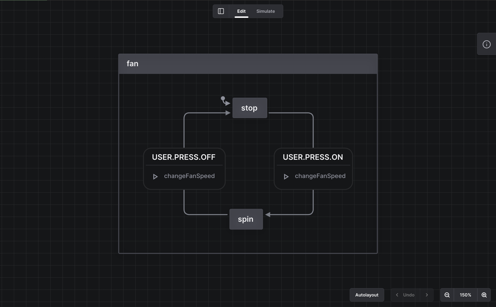

> **NOTE:**
> Ketika tulisan ini dibuat, saya masih menggunakan XState versi 4. Saya mungkin akan menuliskan perubahan atau perbedaan antara XState versi 4 dan 5. Tapi pada dasarnya, konsep yang digunakan sama.

Di tulisan ini, saya ingin berbagi tentang _finite state machine_ dan bagaimana membuat FSM dengan XState. Saya juga membagikan hasil akhir dari project yang ada di tulisan ini di [link berikut](https://github.com/ibedwi/logs-fsm-with-xstate/tree/2023.12.03).

## Menyiapkan project

Saya menggunakan Next.js 13 dengan app _directory_ dan TailwindCSS. Libraries yang perlu di-_install_. Tutorial membuat project Next.js dengan _app router_ dapat ditemukan [di link ini](https://nextjs.org/docs/getting-started/installation).

```
What is your project named? logs-understanding-fsm-with-xstate
Would you like to use TypeScript? Yes
Would you like to use ESLint? Yes
Would you like to use Tailwind CSS? Yes
Would you like to use `src/` directory? Yes
Would you like to use App Router? (recommended) Yes
Would you like to customize the default import alias (@/*)? Yes
What import alias would you like configured? @/*
```

_Libraries_ lain yang dibutuhkan akan saya jelaskan pada subbab terkait.

## Apa itu Finite State Machine?

Apa itu _finite state machine_? Cara saya memahami istilah ini adalah dengan mencoba membedah dan memahami tiap kata yang ada dalam istilah ini:

**Machine**
Machine di sini merujuk kepada “a model of a system”. Model sendiri bisa diartikan sebagai sebuah representasi yang informatif dari sesuatu (yaa intinya representasi dari sistem).

**State**
State di sini merujuk kepada informasi. Lebih spesifik lagi, informasi yang dimaksud adalah _behavior_ (perilaku atau tingkah laku) dari sebuah system.

Jika dua kata ini digabungkan, “state machine” dapat dipahami sebagai representasi dari _behavior_ sebuah system. Sebuah state machine, tentunya terdiri dari daftar tingkah lakunya. State machine juga mendeskripsikan transisi dari satu state ke state lain. Transisi ini dipicu oleh _input_ yang diberikan kepada state machine tersebut.

Kata terakhir, “_finite_”, memiliki makna bahwa _state_ yang ada di dalam _state machine_ jumlahnya terbatas.

## Memodelkan finite state machine kipas angin

Berhubung cuaca di tempat saya tinggal saat menulis tulisan ini sedang panas, maka kita akan menggunakan kipas angin sebagai contoh kasus. Kita akan membuat model kipas angin dengan menggunakan FSM.

### Memasang XState

Sebelum mulai memodelkan FSM kipas angin, kita harus meng-_install_ beberapa _libraries_ yang berkaitan dengan _finite state machine_ terlebih dahulu:

```bash
yarn add xstate@^4.38.1 @xstate/react@^3.2.2
```

### VSCode Extension

Untuk kemudahan _development_, saya menggunakan [_extension_ Stately di VSCode](https://marketplace.visualstudio.com/items?itemName=statelyai.stately-vscode). _Extension_ ini sangat memudahkan dalam memodelkan FSM karena menggunakan GUI.

### Pemodelan FSM kipas angin

Untuk membuat sebuah FSM dengan XState, kita bisa menggunakan fungsi `createMachine`:

```ts
import { createMachine } from "xstate";
export const fanMachine = createMachine({
  id: "fan",
});
```

_Property_ `id` digunakan untuk mengidentifikasi mesin yang kita buat.

Untuk memodelkan bagaimana sebuah kipas angin bekerja, kita bisa mulai dengan pertanyaan: “apa saja `state` dari sebuah kipas angin?”. Mudah, `stop` dan `spin`. `stop` artinya kipas angin kita tidak berputar, sedangkan `spin` artinya berputar. Intinya ada keadaan ketika kipas angin menyala dan mati. Kita bisa menuliskan `state` dari kipas angin ini ke dalam definisi machine kita sebagai berikut:

```ts
import { createMachine } from "xstate";

export const fanMachine = createMachine({
  id: "fan",

  states: {
    stop: {},
    spin: {},
  },

  initial: "off",
});
```

_Property_ `states` adalah daftar `state` apa saja yang dimiliki oleh _machine_ kita dan _property_ `initial` menentukan `state` awal saat _machine_ pertama kali dijalankan.

Sekarang, _machine_ kita sudah punya `state`. Tapi, kita belum menentukan bagaimana _machine_ kita bisa berpindah dari `state` `stop` ke `spin`.

---

### (Tips) Typescript support (you can skip this part if you’re not using TypeScript)

Jika kamu juga menggunakan TypeScript, XState menyediakan _types generator_ (typegen) dari _machine_ kita. Berdasarkan [dokumentasi ini](https://xstate.js.org/docs/guides/typescript.html#typegen), pengguna VSCode hanya perlu meng-_install_ sebuah _extension_.

Lalu di dalam definisi _state machine_ kita, kita hanya perlu menambahkan _property_ `tsTypes: {}`. Ketika kita menyimpan _file_ tersebut, _typings_ dari _state machine_ kita akan otomatis terbuat.

---

### Transisi `state`

Dalam XState, transisi dari sebuah `state` ke `state` lain dipicu oleh sebuah `event`. `event` di sini sepadan dengan “input” yang kita singgung pada bagian pengertian FSM di atas.

Untuk kasus kita, transisi yang kita butuhkan untuk berpindah adalah transisi state `stop` ke `spin` dan sebaliknya. Transisi ini dipicu oleh _user_ yang menyalakan atau mematikan kipas angin. Dalam XState, kita bisa menulis transisi ini pada _property_ `on` dari sebuah `state`:

```ts
export const fanMachine = createMachine({
  id: "fan",

  states: {
    stop: {
      on: {
        "USER.PRESS.ON": "spin",
      },
    },

    spin: {
      on: {
        "USER.PRESS.OFF": "stop",
      },
    },
  },

  initial: "stop",
});
```

Kurang lebih, transisi pada `state` `stop` bisa dibaca: “Ketika `USER.PRESS.ON`, transisi ke `spin`”.

Yang menarik dari XState, kita bisa menggunakan nilai string apa saja sebagai nama nilai `EVENT`. Di sini saya menggunakan _convention_ nama aksi yang ditulis dalam _uppercase_ dan tiap kata dipisahkan oleh titik alih-alih oleh spasi.

Untuk menghasilkan _generated typings_ yang lebih baik, kita bisa menuliskan `EVENT` apa saja yang dikenali oleh machine kita. Misalnya:

```ts
type MachineEvent = { type: "USER.PRESS.ON" } | { type: "USER.PRESS.OFF" };

export const fanMachine = createMachine({
  id: "fan",
  tsTypes: {} as import("./fanMachine.fsm.typegen").Typegen0,
  schema: {
    events: {} as MachineEvent,
  },
  // ...
});
```

### Memperkaya _state machine_ dengan informasi tambahan

Kita sudah berhasil membuat kipas angin kita menyala dan mati. Tapi, bagaimana dengan kecepatan putaran kipas? Di XState, informasi tambahan (atau sederhananya, data) yang diketahui oleh `machine` disimpan ke dalam `context`.

Dalam kasus kita, informasi tambahan yang dibutuhkan adalah kecepatan dari kipas.

Kita bisa menambahkan kecepatan ke dalam property `context`:

```ts
export const fanMachine = createMachine({
  id: "fan",
  context: {
    fanSpeed: 0,
  },
  // ...
});
```

Kita juga bisa membuat `type` untuk `context` dan menambahkannya ke dalam `schema`:

```ts
type MachineContext = {
  fanSpeed: number;
};

// ...

export const fanMachine = createMachine({
  id: "fan",
  schema: {
    events: {} as MachineEvent,
    context: {} as MachineContext,
  },
  // ...
});
```

Sekarang, `machine` kita memilki informasi tambahan, `fanSpeed`, yang disimpan di dalam `context`.

### Mengubah nilai dari `context` dengan `action`

Sejauh ini, kita sudah menambahkan kecepatan kipas, `fanSpeed` , ke dalam `machine` melalui `context`. Tapi, ketika `state` transisi dari `stop` ke `spin`, `fanSpeed` dari kipas angin kita masih 0!

Untuk merubah nilai dari `context`, kita bisa memanfaatkan salah satu fitur dari XState, yaitu `action`.

Di XState, `action` adalah salah satu bentuk _side-effect_ yang bisa di-_trigger_. Kapan `action` ke-_trigger_? `action` bisa di-_trigger_ ketika perpindahan `state`, yaitu ketika masuk atau keluar `state`, atau di-_trigger_ oleh `event`. `action` dalam XState adalah _pure function_; umumnya bersifat _synchronous_. Kita bisa menggunakan `action` untuk merubah nilai dari `context`.

#### Menambahkan `action` pada `event`

Pertama, mari kita update `event` yang kita kirim ketika transisi dari `stop` ke `spin` dan sebaliknya untuk memicu `action` yang akan merubah nilai dari `fanSpeed`. Mari kita beri nama `action` ini `changeFanSpeed`. `action` ini ditambahkan pada property `actions` yang ada di dalam `event`.

```ts
export const fanMachine = createMachine({
  id: "fan",
  // ...
  states: {
    stop: {
      on: {
        "USER.PRESS.ON": {
          target: "spin",
          // v let's add action here!
          actions: "changeFanSpeed",
        },
      },
    },

    spin: {
      on: {
        "USER.PRESS.OFF": {
          target: "stop",
          // v let's add action here!
          actions: "changeFanSpeed",
        },
      },
    },
  },
  // ...
});
```

#### Menulis implementasi dari `action` `changeFanSpeed`

Langkah selanjutnya adalah menuliskan implementasi dari `action` `changeFanSpeed`.

Berdasarkan dokumentasinya, fungsi `createMachine` menerima 2 argumen, yang pertama adalah konfigurasi `machine` dan yang kedua adalah `options`. Salah satu _property_ dari `options` adalah `actions`, tempat di mana kita menuliskan implementasi dari actions. Hampir setiap property yang ada di `options` — entah itu `guards`, `actions`, atau `services` — yang berbentuk fungsi, akan menerima 2 argumen secara berurutan yaitu `context` saat `action` tersebut di-trigger dan `event` yang men-_trigger_ `action` tersebut. Kita dapat menuliskan `action` `changeFanSpeed` seperti ini:

```ts
export const fanMachine = createMachine(
  {
    // ...
  },
  {
    actions: {
      changeFanSpeed: (_context, event) => {
        /* implementation goes here */
      },
    },
  }
);
```

Tetapi, untuk merubah `context`, kita butuh _built-in_ `action` dari XState yang disebut “assign action”. Sederhananya, _assign action_ ini adalah fungsi yang menerima nilai baru yang akan diterapkan ke `context` dan akan menetapkan nilai tersebut ke dalam `context`. Jika nilai dari `context` terbaru yang kita inginkan adalah hasil dari `action` , kita cukup membungkus `action` tersebut ke menggunakan fungsi `assign`.

```ts
import { assign } from "xstate";

export const fanMachine = createMachine(
  {
    // ...
  },
  {
    actions: {
      changeFanSpeed: assign((_context, event) => {
        /* implementation goes here */
      }),
    },
  }
);
```

Misal, nilai `fanSpeed` ketika kipas angin pertama kali dinyalakan adalah `1`. Kita bisa menuliskan _assign action_ `changeFanSpeed` seperti ini:

```ts
export const fanMachine = createMachine(
  {
    id: "fan",
    // ...
    states: {
      stop: {
        on: {
          "USER.PRESS.ON": {
            target: "spin",
            actions: "changeFanSpeed",
          },
        },
      },

      spin: {
        on: {
          "USER.PRESS.OFF": {
            target: "stop",
            actions: "changeFanSpeed",
          },
        },
      },
    },
    // ...
  },
  {
    actions: {
      changeFanSpeed: assign((_context, event) => {
        if (event.type === "USER.PRESS.ON") {
          return {
            fanSpeed: 1,
          };
        }
        if (event.type === "USER.PRESS.OFF") {
          return {
            fanSpeed: 0,
          };
        }
        return {};
      }),
    },
  }
);
```

Sekarang, kita sudah memilki FSM kipas angin!

Selanjutnya, salah satu bagian yang tak kalah seru: mengintegrasikan FSM yang sudah kita buat ke UI!

Jika kamu juga menggunakan _extension_ VSCode, FSM kita saat ini kurang lebih terlihat seperti ini:



## Mengintegrasikan state machine ke UI

Sebelum melanjutkan, kita perlu meng-_install_ beberapa _libraries_ terlebih dahulu:

```bash
yarn add framer-motion@^10.16.12 react-icons@^4.12.0
```

### Mengintegrasikan FSM ke React component

Pertama-tama, mari kita buat sebuah _component_ bernama `Fan.tsx.` _Component_ ini bisa dianggap sebagai representasi visual dari kipas angin.

Dalam XState, `machine` yang sudah kita definisikan, `fanMachine` , bisa dianggap sebagai definisi dari sebuah proses. Sedangkan proses yang berjalan berdasarkan definisi yang sudah kita buat disebut sebagian `service` atau `actor`. Beberapa waktu terakhir, saya rasa istilah `actor` lebih sering digunakan.

XState menyediakan _hook_ bernama `useMachine` untuk membuat `actor` (proses) dari machine yang sudah kita definisikan. _Hook_ ini mengembalikan _tuple_, yang berisi informasi dari `actor` yang sedang berjalan dalam bentuk `object`, fungsi untuk mengirim `event` ke `actor`, dan referensi ke `actor` yang sudah dibuat. Selain itu, _hook_ ini juga mengikat `actor` ke dalam _lifecycle_ dari _component_. Jadi ketika _component_ di-_unmount_, `actor` akan berhenti dan akan mulai dari awal lagi (dari initial state) ketika component di-_mount_.

```tsx
export function Fan() {
  const [fsmState, fsmSendEvent] = useMachine(fanMachine);

  const isOn = fsmState.matches("spin");
  const speed = fsmState.context.fanSpeed;

  return <div>{/* ... */}</div>;
}
```

`isOn` menyimpan hasil dari _method_ `matches`. _Method_ ini digunakan untuk memastikan apakah`state` dari `actor` saat ini sesuai dengan argumen yang diberikan. Sedangkan untuk mengakses `context`, kita bisa menggunakan property `context` dari informasi yang kita dapatkan dari _tuple_ yang dikembalikan oleh hook `useMachine`, `fsmState`.

### Membuat UI

Berikut adalah UI sederhana yang menggambarkan kipas angin:

```tsx
// utils to merge an array of `className`s
function cn(...classes: any[]) {
  return classes.filter(Boolean).join(" ");
}

export function Fan() {
  // ...
  return (
    <div className="flex flex-col items-stretch py-3 px-4 bg-gray-200 rounded-lg gap-5">
      <div>
        <FaDotCircle
          className={cn("text-md", isOn ? "text-green-400" : "text-red-400")}
        />
      </div>
      <FaFan className="text-8xl text-gray-500" />
      <div className="flex flex-row item-center justify-between w-full gap-[150px]">
        <button
          className={cn(
            "p-2 rounded-lg",
            !isOn ? "bg-red-300 text-white" : "bg-red-400 text-black"
          )}
        >
          Off
        </button>
        <button
          className={cn(
            "p-2 rounded-lg",
            isOn ? "bg-green-300 text-white" : "bg-green-400 text-black"
          )}
        >
          On
        </button>
      </div>
    </div>
  );
}
```

### Mengirim `event` ke `actor`

UI kita sudah selesai dan sekarang kita ingin bisa mngirim `event` ke `actor` yang sudah kita buat. Kita bisa menggunakan `fsmSendEvent` yang sudah kita dapatkan sebelumnya. (Salah satu hal yang paling saya sukai adalah _suggestions_ dari IDE ketika menuliskan `event` yang ingin kita kirim).

```tsx
export function Fan() {
  // ...
  return (
    <div className="flex flex-col items-stretch py-3 px-4 bg-gray-200 rounded-lg gap-5">
      {/* ... */}
      <div className="flex flex-row item-center justify-between w-full gap-[150px]">
        <button
          // ...
          onClick={() => fsmSendEvent({ type: "USER.PRESS.OFF" })}
        >
          Off
        </button>
        <button
          // ...
          onClick={() => fsmSendEvent({ type: "USER.PRESS.ON" })}
        >
          On
        </button>
      </div>
    </div>
  );
}
```

Hanya dengan mengirim `event`, sekarang `machine` kipas angin sudah terintegrasi dengan React component kita! Tapi masih ada satu hal lagi yang kurang, yaitu animasi. Tenang, ini tidak akan lama ;)

### Menambahkan animasi putaran kipas

Pada bagian animasi, kita menggunakan `framer-motion`. Kita ingin memutar baling-baling kipas berdasarkan kondisi menyala atau mati dengan kecepatan yang sudah ditentukan. Mengingat tulisan ini bukanlah tentang animasi, saya tidak akan memberikan penjelasan panjang lebar tentang bagaimana menggunakan `framer-motion` secara detail.

```tsx
export function Fan() {
  // animation values
  const calculatedSpeed = isOn ? 1000 - 100 * speed : 0;
  const time = useTime();
  const rotate = useTransform(
    time,
    [0, calculatedSpeed], // For every calculatedSpeed,
    [0, -360], // rotate 360 degrees to the left direction
    {
      clamp: false, // make it rotate forever
    }
  );

  return (
    <div className="flex flex-col items-stretch py-3 px-4 bg-gray-200 rounded-lg gap-5">
      <motion.div
        style={{ rotate }}
        className="flex justify-center items-center"
      >
        <FaFan className="text-8xl text-gray-500" />
      </motion.div>
      {/* ... */}
    </div>
  );
}
```

Pada baris kode di atas, kita menggunakan `rotate` yang dihasilkan dari _hook_ `useTransform` milik framer motion.

## Demo

[Loom](https://www.loom.com/share/5d9faea27d5c4701b4962eb982152926?sid=eb1e13c4-fe46-4f2e-800c-e9b65a50fade)

## _Summary_

Di tulisan ini, kita sudah belajar tentang konsep _finite state machine_ dan implementasinya menggunakan XState di Next.js.

Saya sendiri yakin bahwa XState adalah salah satu _library_ yang bermanfaat dalam situasi yang kompleks.

Terima kasih sudah membaca!
